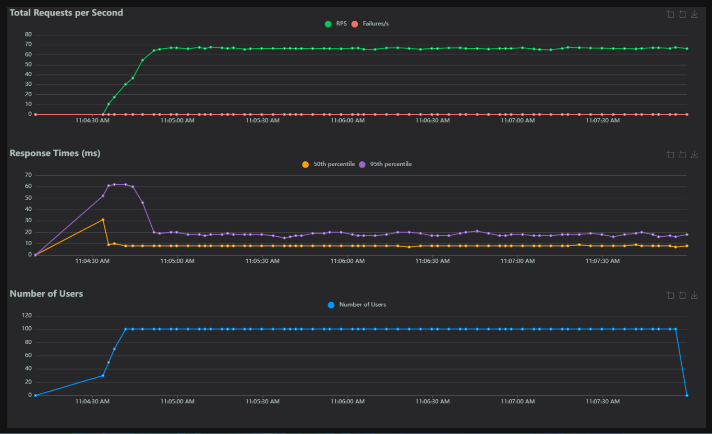

# 💼 Job Application Tracker

> A modern, full-stack web application to track, analyze, and optimize your job search journey.

---

## 🎯 What is This?

Job Application Tracker is a personal project I built to help manage the job search process effectively. It's a complete web application that lets you:

- ✅ Track all your job applications in one centralized dashboard
- 📊 Visualize your job search progress with beautiful analytics
- 🤖 Get AI-powered predictions on application success
- ⚡ Experience blazingly fast performance with intelligent caching
- 🎨 Enjoy a modern, responsive user interface

Perfect for anyone going through a serious job search and wanting data-driven insights!

---

## ✨ Key Features

### 📝 Smart Application Tracking

Track every detail of your job search in one place:

- Company name, position, salary range
- Application stage (Resume → Phone Screen → Technical → Onsite → Offer)
- Status tracking (Pending, Accepted, Rejected, Withdrawn)
- Rejection reasons and follow-up dates
- Custom notes for each application
- Multiple application sources (LinkedIn, Referrals, Job Boards, etc.)

### 📈 Powerful Analytics Dashboard

Gain insights into your job search patterns:

- **Key Metrics**: Total apps, active applications, rejection rate, offers
- **Stage Breakdown**: See where most applications get filtered out
- **Source Analysis**: Understand which job boards work best for you
- **Rejection Insights**: Identify patterns and weak spots
- **90-Day Timeline**: Visualize your progress over time

### 🤖 ML-Powered Success Predictions

Let AI help predict your chances:

- Machine learning model trained on your historical data
- Predicts success probability for new applications
- Considers: company, source, time of application, day of week
- Learns and improves over time

### ⚡ Lightning-Fast Performance

Optimized for speed:

- Redis caching for 50%+ faster API responses
- Lazy-loading frontend components
- Database query optimization with indexes
- Full-width responsive design

---

## 🏗️ How It Works

```

Your Computer
      ↓
┌─────────────────────┐
│   React Frontend    │  ← Modern UI with TypeScript
│   (Your Browser)    │
└──────────┬──────────┘
           │ REST API
           ↓
┌─────────────────────┐
│  FastAPI Backend    │  ← Fast Python API
│   (Server)          │
└──────┬──────┬───────┘
       ↓      ↓
    Database  Cache   ← Where data is stored
  (PostgreSQL) (Redis)
```

---

## 🛠️ Tech Stack

Built with modern, proven technologies:

| Layer | Technology | Why |
|-------|-----------|-----|
| **Frontend** | React 19, TypeScript, Tailwind CSS | Type-safe, beautiful UI |
| **Backend** | FastAPI (Python) | Fast, easy to develop |
| **Database** | PostgreSQL | Reliable, powerful |
| **Cache** | Redis | Makes everything faster |
| **ML** | scikit-learn | Proven ML library |
| **Deployment** | Docker Compose | One-command deployment |

---

## 🚀 Quick Start

### Easiest Way: Docker Compose

```bash
# 1. Clone the project
git clone <repository-url>
cd job_application_tracker

# 2. Copy environment file
cp .env .env.production

# 3. Start everything
docker-compose up -d

# Done! Access:
# Frontend: http://localhost:5173
# API: http://localhost:8000
# API Docs: http://localhost:8000/docs
```

### Local Development (if you prefer)

```bash
# Backend
python -m venv venv
source venv/bin/activate  # or: venv\Scripts\activate on Windows
uv sync
uvicorn main:app --reload

# Frontend (in another terminal)
cd job_tracker_frontend
bun install
bun dev
```

---

## 📊 How to Use

### Step 1: Add Your Applications

```

Click "+ Add Application" → Fill in details → Save
```

Fields you can track:

- Company & Position
- Stage & Status
- Salary range
- Application source
- Notes & follow-ups
- Rejection reasons

### Step 2: Track Progress

In the **Applications** tab:

- See all your applications in a table
- Filter by company, stage, or status
- Click on any application to view/edit details
- Delete applications as needed

### Step 3: Review Analytics

In the **Analytics** tab:

- View key metrics (total apps, rejection rate, etc.)
- See which stages filter most applications
- Compare different application sources
- Check 90-day trends
- Get AI success predictions

### Step 4: Make Data-Driven Decisions

Use insights to:

- Focus on sources that work
- Target companies with high success rates
- Improve weak areas in your pipeline
- Optimize your job search strategy

---

## 📚 API Endpoints

### Create/Read/Update/Delete Applications

```

POST   /api/applications              Create new application
GET    /api/applications              List with filtering
GET    /api/applications/{id}         Get one application
PUT    /api/applications/{id}         Update application
DELETE /api/applications/{id}         Delete application
```

### Analytics Endpoints

```

GET    /api/analytics/overview        Get dashboard metrics
GET    /api/analytics/rejections      Analyze rejections
GET    /api/analytics/time-series     90-day trends
POST   /api/analytics/predict         Get AI predictions
```

See **[API.md](./API.md)** for detailed examples.

---

## ⚡ Performance

I take performance seriously. The application is optimized to handle high loads efficiently.


*Figure: Locust load testing results showing system stability under load.*

Results with caching enabled:

| Operation | Without Cache | With Cache | Speed Up |
|-----------|--------------|-----------|----------|
| List applications | 300ms | 50ms | 6x faster |
| Get analytics | 500ms | 30ms | 16x faster |
| Get single app | 150ms | 20ms | 7x faster |

That's why caching is so important!

---

## 🤖 ML Model: How Predictions Work

The model learns from your data:

```

Historical Data
├── Company (Google, Microsoft, etc.)
├── Application Source (LinkedIn, Referral, etc.)
├── Day & Time Applied
├── Outcome (Got offer? Rejected? Still pending?)
│
→ Train ML Model
│
→ Predict: "New application has 72% success chance"
```

Train it after collecting ~10 applications:

```bash
python train_model.py
```

---

## 🔧 Configuration

Create a `.env` file in the root directory:

```bash
# Database Settings
DB_USER=your_username
DB_PASSWORD=your_password
DB_HOST=localhost
DB_PORT=5432
DB_NAME=job_tracker_db

# Cache Settings
REDIS_PASSWORD=your_redis_password

# URLs
BACKEND_URL=http://localhost:8000
FRONTEND_URL=http://localhost:5173
VITE_API_URL=http://localhost:8000
```

See `.env.example` for all options.

---

## 🐛 Troubleshooting

### "Port already in use"

```bash
# Windows: Find and kill process on port 5173
netstat -ano | findstr :5173
taskkill /PID <PID> /F

# Or just change port in .env
```

### "Can't connect to database"

```bash
# Make sure PostgreSQL is running
psql -U your_username -d job_tracker_db

# If using Docker:
docker-compose restart postgres
```

### "Frontend shows blank page"

```bash
# Check if backend is running
curl http://localhost:8000/docs

# Clear browser cache
# Ctrl+Shift+Delete or Cmd+Shift+Delete
```

### "API returns 'Connection Refused'"

```bash
# Make sure backend is running
docker-compose logs backend

# Check if port 8000 is available
```

---

## 📖 Full Documentation

For more details, check out:

- **[API.md](./API.md)** - All API endpoints with examples
- **[CACHING.md](./CACHING.md)** - How caching speeds things up
- **[ANALYTICS.md](./ANALYTICS.md)** - ML model details
- **[DEPLOYMENT.md](./DEPLOYMENT.md)** - Deploy to production

---

## 🚀 Deployment

### Deploy to Cloud

Supports deployment to:

- AWS EC2 + RDS + ElastiCache
- DigitalOcean App Platform
- Railway
- Render

See **[DEPLOYMENT.md](./DEPLOYMENT.md)** for step-by-step guides.

---

## 🔒 Security Notes

- ✅ SQL injection prevention (SQLAlchemy ORM)
- ✅ Input validation (Pydantic models)
- ⚠️ For production: Add JWT authentication
- ⚠️ For production: Enable HTTPS
- ⚠️ Use strong passwords for PostgreSQL/Redis

---

## 📊 Project Stats

- **5 React Pages** - Dashboard, Applications, Analytics, Add, Detail
- **7+ API Endpoints** - Full CRUD + Analytics + Predictions
- **2 Databases** - PostgreSQL + Redis
- **1 ML Model** - scikit-learn Random Forest
- **1 Docker Setup** - All-in-one deployment
- **100% Responsive** - Works on desktop, tablet, mobile

---

## 🎯 What's Next?

Future improvements could include:

- 🔐 User authentication & login
- 📧 Email notifications for follow-ups
- 📄 Resume upload & parsing
- 🚀 Advanced ML models
- 📱 Mobile app version
- 🤝 Share job search with friends
- 💬 Interview prep resources

---

## 📝 License

Personal project - feel free to use and modify!

---

## 💡 Tips for Job Searching

1. **Apply consistently** - Track every application
2. **Analyze patterns** - Use the analytics to find what works
3. **Follow up** - Set reminders with the follow-up date feature
4. **Learn from rejections** - The rejection analysis shows common weak spots
5. **Trust the data** - Let the ML model guide you on promising leads

---

## 🙏 Acknowledgments

Built with:

- FastAPI for the amazing backend framework
- React for the responsive UI
- PostgreSQL for reliable data storage
- Redis for blazing-fast caching
- scikit-learn for ML capabilities

---

*Last Updated: December 14, 2025*

*Built with ❤️ by Carnit*
